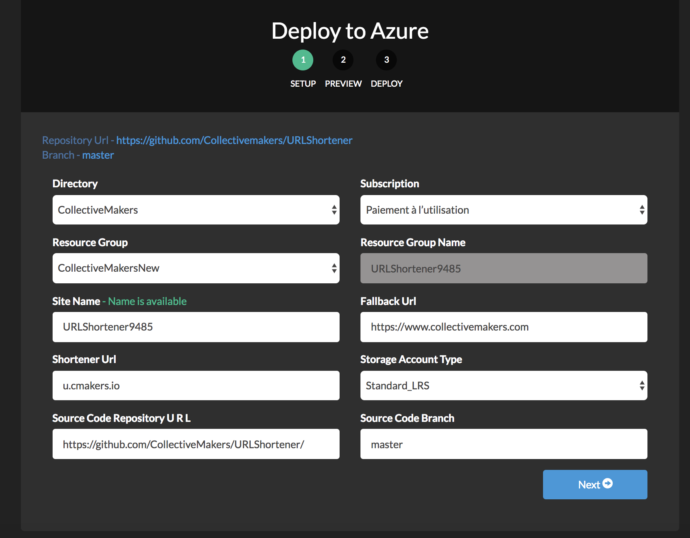
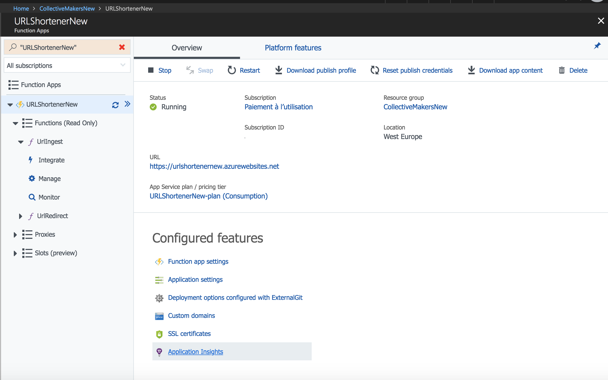

# Azure Function URL Shortener

This project represents a full serverless URL shortener application running on Azure Functions and Azure Table Storage.
Once deployed the application allows to :
- create short URLs related to longer target URLs and medium where the short URLs will be published
- redirect short URLs HTTP requests to the target URL
- provide statistics about short URLs usage

To easily provision all needed resources and deploy code on your Azure tenant, just click the link below.
[](http://u.cmakers.io/5m)

## Prerequisites
1) DNS : You should own and be able to configure new DNS records on the domain you want to use as a short URL domain.
2) Azure subscription : You need an Azure subscription to deploy and run this application. If you are new on Azure you can create a trial account and run this app for free during 30 days.  

## Getting Started

This section is walkthrough to deploy and test the application.



If you have multiple directories and subscriptions, choose the correct one. Pick a resource group and give your app a sitename and a shortener URL hostname.
If you want to use a new resource group, I suggest you previously create it on azure portal to choose the right location.

When you're done with the choice of your short URL and sitename, you should register the following CNAME on your DNS servers (Deployment will fail if you don't do it correctly):
```
my.short.url. 300   IN  CNAME mysitename.azurewebsites.net
```

The fallback URL is the URL the service will redirect to when an invalid short URL is provided. All values will be updated to the application settings for the function app and may be changed at a later date. Choose the storage option (the default should be fine). Keep the default URL for the repository unless you forked the code for your own.

>**Note**: sometimes the deployment may fail with a random error. If it does this, choose the option to try again. In my experience it will often succeed on the second try, especially if the error is related to source code (there appear to be some sporadic issues with fetching the code from GitHub).

This is what a successful screen looks like:


Once the project has deployed, click or tap "Manage" to navigate to the resource group in the Azure portal. Click on the function app name.


Next, tap on the `UrlIngest` function to create your first short URL. Tab the "Test" tab on the right to enter a request body and specify the following: 

```json
{
    input: "https://www.collectivemakers.com"
}
```

(You can choose your own URL).


Tap the "Run" button and you should receive a list of results with your shortened URL.


You can also use a desktop REST API client such as Rested. Just beware that you need to add a "Content-type: application/json" header.

You can either copy the "ShortUrl" property from the JSON returned, or build the link yourself from the short url. Open a browser, and paste the URL. This example assumes the shortener URL "u.cmakers.io" was used.

`http://u.cmakers.io/2q`

The site should redirect to the URL you set up in the previous step. Your URL is ready to go! To view analytics, tap on the Function App name then click the Application Insights feature.



You should immediately begin to see data generated from your functions app.

## Client Web Tool

For your convenience, you can also create a lightweight Docker image to run a small client to make it easier to generate URLs without logging into the portal. First, navigate to the "UrlIngest" function and click "Get function URL."


Copy the value. This should include your secret function key. Next, navigate to the `webApp` directory and replace the value for `apiRoot` in first line of `index.js` with the URL you just copied.

```JavaScript
const apiRoot = "https://<azureafunctionname>.azurewebsites.net/api/UrlIngest?code=<FunctionAPIkey>";
```

Save the file and build the Docker image:

`docker build -t shortener .`

Once the image has built, run it. This example maps it from the default web port 80 to 8888.

`docker run -d -p 8888:80 shortener`

>**Important note about CORS**: in order for the function URL to be accessible from your local browser, it must be configured with a Cross-Origin Rresource Sharing (CORS) entry in the function app.


Then add the URL of the origin you want to allow to make cross-origin calls (for example http://localhost:8888 if you run the docker image as described above)


Navigate to [http://localhost:8888](http://localhost:8888) to run the app.


Choose the medium where the short URL will be published, then paste the long URL and tap "Shorten" to generate the short URLs.
